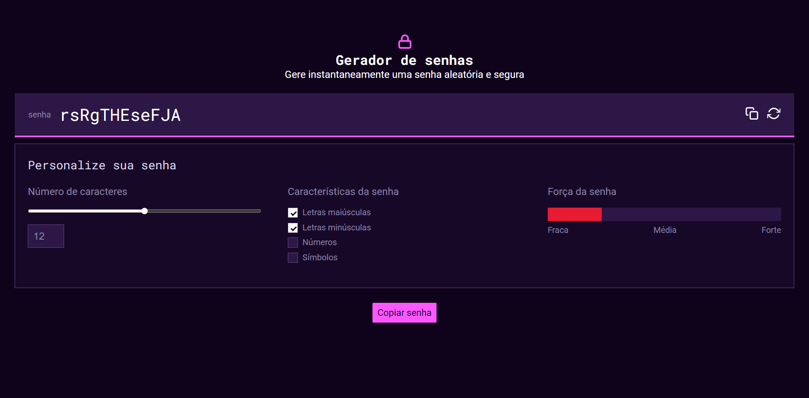
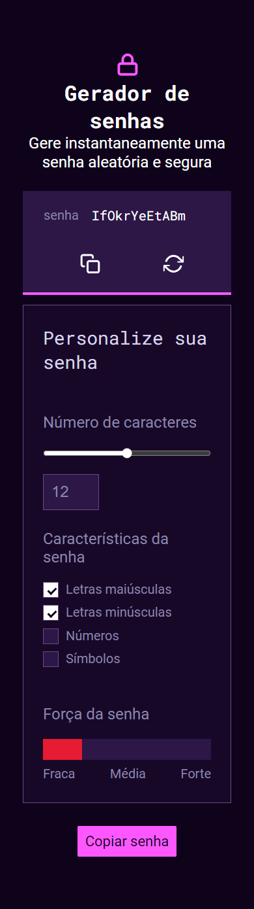

> Project developed for the technical challenge for the position of Front End Developer Person (Affirmative job posting for women) at Alura.

# Passoword Generator

Password Generator with controls for number of characters, password characteristics and display for password strenght.

## Challenge Context

The application generates customizable passwords using uppercase letters, lowercase letters, numbers and symbols, thus informing the strength of the password.

The first button to the left of the password generator field and the button at the bottom of the page must copy the generated password, and the other button must generate a new password. By default, if no password characteristics have been selected, passwords of only lowercase letters must be generated.

Defining characteristics of password strength:

- Weak: No field selected, only uppercase letters selected, only lowercase letters selected, both uppercase and lowercase letters selected.
- Average: Uppercase, lowercase letters and any other selected field.
- Strong: All fields selected.

## Utilized Technologies

This project was developed with the following technologies:

- HTML
- CSS
- JavaScript
- SASS

## Preview Desktop

## Preview Mobile

## Instructions

- Make sure that you have **`npm`** installed in your computer.
- Do a `git clone` on the repository.
- Using the terminal, navigate to the project folder using `cd password-generator`.
- Run the `npm install` command to install dependencies.
- After that, run the `npm run sass` command.
- Open the `index.html` file with the **Live Server** extension and the application should launch in a tab in your browser.

Now you can generate a password!
